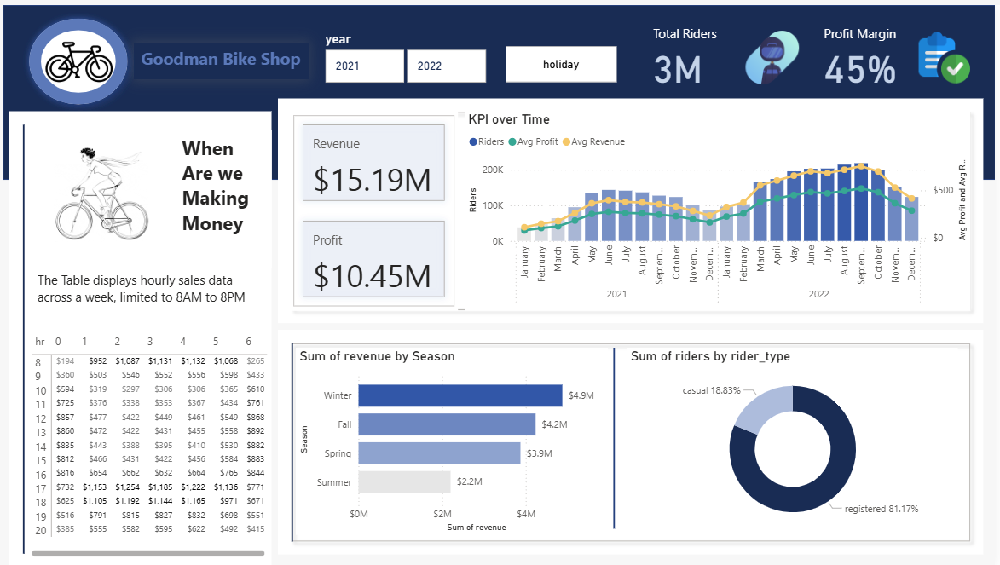

# 🚴‍♂️ Goodman Bike Shop Power BI Dashboard



## 📊 Project Overview

This Power BI dashboard provides an analytical overview of sales performance, profit margins, and rider behavior for **Goodman Bike Shop**.  
The project was developed to uncover insights on **revenue trends**, **profitability patterns**, and **customer engagement** across different times and seasons.

---

## 🧠 Key Insights

- **Total Riders:** 3M  
- **Profit Margin:** 45%  
- **Total Revenue:** $15.19M  
- **Total Profit:** $10.45M  

The dashboard explores:
- 🕐 *When are we making money?*  
- 📅 *Which seasons drive the most revenue?*  
- 🚴 *How do rider types (casual vs registered) impact performance?*  
- 💰 *How do profit and revenue evolve over time?*  

---

## 🧩 Dashboard Features

### 1. **Revenue & Profit KPIs**
- Displays aggregated **revenue** and **profit** metrics.
- Interactive visual showing **Riders**, **Average Profit**, and **Average Revenue** over time.

### 2. **Hourly Sales Table**
- Shows hourly sales from **8 AM to 8 PM** throughout the week.
- Identifies **peak earning hours** for operational optimization.

### 3. **Seasonal Revenue Breakdown**
- Bar chart comparing revenue across **Winter**, **Fall**, **Spring**, and **Summer**.
- Highlights seasonal variations in customer demand.

### 4. **Rider Type Distribution**
- Donut chart visualizing **Casual (18.83%)** vs **Registered (81.17%)** riders.
- Useful for understanding customer loyalty and behavior.

---

## 🗂️ Repository Structure

```plaintext
root/
├── 📊 image.png         # Dashboard preview (shown above)
├── 📁 data/             # Contains real sample data used for analysis
├── 📁 assets/           # Contains icons and visual elements used in the report
└── README.md


- The dashboard uses **real sample data** stored in the `data/` folder.
- Custom icons and design assets are located in the `assets/` folder to enhance visualization aesthetics.

---

## 🛠️ Tools & Technologies

- **Power BI** – Data visualization and modeling  
- **DAX (Data Analysis Expressions)** – Calculated measures and KPIs  
- **Power Query (M language)** – Data transformation and cleaning  
- **Real Sample Data** – Used to simulate business operations and insights  

---

## 📅 Time Frame

Data covers **2021** and **2022**, with an interactive **holiday** filter for seasonal analysis.

---

## 🎯 Learning Objectives

- Build professional, interactive dashboards in Power BI  
- Implement DAX for advanced KPIs and trend analysis  
- Apply data storytelling techniques with a clean UI  
- Understand seasonal and hourly performance drivers  

---

## 📸 Dashboard Preview


---

## 👨‍💻 Author

**Arman S. Chowdhury**  
📍 Power BI Developer | Data Analyst  
🔗 [LinkedIn Profile](https://www.linkedin.com/in/arman-sakif-09/)  

---

### ⭐ If you found this project insightful, consider giving it a star on GitHub!
